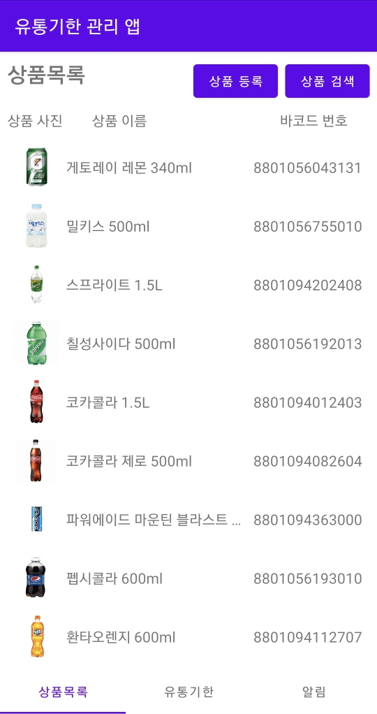

# ExpirationDateManagement



상품과 유통기한을 쉽게 관리하고 유통기한 경과 알림을 보내주는 안드로이드 어플리케이션입니다.

## Getting Started / 어떻게 시작하나요?

Android Studio로 프로젝트를 열고 프로젝트를 빌드하여 실행하시면 됩니다.

### Prerequisites / 선행 조건

아래 사항들이 설치가 되어있어야 합니다.

```
Android Studio 2020.3.1 이상, Android SDK Tools 23 이상, Android 8.0(Oreo) 이상
```

## Built With / 누구랑 만들었나요?

* [박세훈](https://github.com/psh3253) - 프로젝트 전체 설계 및 제작

## Function / 기능
+ 상품 등록 및 삭제
+ 상품 이름 또는 바코드 번호를 사용하여 상품 검색
+ 유통기한 등록 및 삭제
+ 유통기한 경과 시 유통기한 자동 삭제 및 알림
+ 유통기한이 경과된 상품이 존재하면 1시간 마다 푸시 알림 전송
+ 바코드를 인식하여 바코드 번호 자동 입력

## Technology / 기술

+ ZXing을 사용하여 바코드 인식 구현
+ Room을 사용하여 데이터 저장

## License / 라이센스

이 프로젝트는 GPL-3.0 라이센스로 라이센스가 부여되어 있습니다. 자세한 내용은 LICENSE 파일을 참고하세요.
